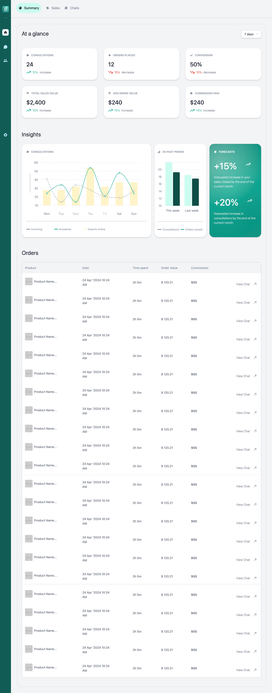

# React TypeScript Project

## Overview

This React TypeScript application, developed for the Wingman frontend assessment, showcases my frontend development skills. It presents a responsive dashboard for visualizing key metrics, including consultations, orders, and sales data, across various devices.

## Dashboard Snapshot

Here is a snapshot of the dashboard implemented:

  


## Features

- **Dynamic Data Visualization**: Displays various metrics using charts and graphs.
- **Responsive Design**: Built with Tailwind CSS for a modern and responsive user interface.
- **Interactive Components**: Includes dropdowns and tables for user interaction.
- **Forecasting Insights**: Provides insights into sales and consultations.
- **Fake REST Call**: Fake API call was simulated.

## Technologies Used

- **React**: JavaScript library for building user interfaces.
- **TypeScript**: Typed superset of JavaScript that compiles to plain JavaScript.
- **Tailwind CSS**: TailwindCSS, a utility-first CSS framework was used for styling.
- **React Icons**: For including icons in the UI.
- **React Chart Libraries**: Recharts library was used for rendering charts and graphs.

## Installation

To get started with this project, follow these steps:

1. Clone the repository:
  ```
  git clone https://github.com/duokobia/wingman-dashboard.git
  cd wingman-dashboard
  ```

2. Install dependencies:
 ```
 npm install
 ```


3. Start the development server:
```
npm start
```


4. Open your browser and navigate to `http://localhost:3000` to view the application.

## Deployment

This React application has been deployed on Vercel. Please click this link to assess the live version of the application [Vercel](https://wingman-dashboard-chi.vercel.app/). 

### Notes on Deployment
- Ensure that all environment variables are set correctly in your deployment settings.
- The build command used during deployment is `npm run build`.

## Usage

Once the application is running, you can interact with the dashboard to view various metrics:

- Use the dropdown to filter data based on different time periods.
- View detailed insights about consultations and orders.
- Explore charts that represent sales trends and forecasts.

## Code Structure

The project structure is organized as follows:


```
wingman-dashboard/
├── src/
│   ├── @types/
│   │   └── ...
│   ├── assets/
│   │   └── ...
│   ├── components/
│   │   └── ...
│   └── App.tsx
│   └── index.css
│   └── index.tsx
└── gitignore
└── package-lock.json
└── package.json
├── postcss.config.js
├── react.d.ts
├── README.md
├── tailwind.config.js
└── tsconfig.json
```


## Acknowledgments

- I extend my deepest thanks to the Wingman team for affording me this opportunity to demonstrate my frontend development capabilities. I would also like to acknowledge the creators of React, TypeScript, Tailwind CSS, and the other libraries that were instrumental in the successful completion of this project.
